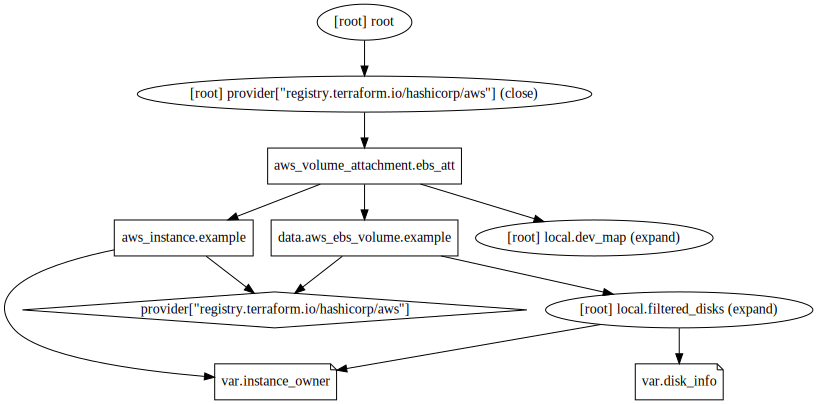

# Dynamic & Conditional Volume Attachment - Vito's Example

  

This code creates an AWS instance and attaches pre-created EBS volumes to it. It uses instance owner, disk information, and device names to determine which volumes should be attached. Only the name tag on the EBS volume, and knowledge of which instance they should belong to, is required to know ahead of time. 

The idea here is that when you create a module for EC2 instances, you can do the following:

- Use a variable to define its identity (can also use the concatenation of name components in the same way, when filtering)
- Use maps to store the disk information that you know pre-runtime (such as what disks will belong to what instance)
- Filter the disks with an expression (with a local) so that you have a local variable that holds only the disks you want
- Create instances of the data source (with count) by filtering on that filtered_disk list
- And then create the attachments based on the count length of the EBS data source, referencing the attributes you need from it dynamically. 

This example meets all the requirements discussed. 

## Requirements

No requirements.

## Providers

| Name | Version |
|------|---------|
|  [aws](#provider\_aws) | 4.52.0 |

## Modules

No modules.

## Resources

| Name | Type |
|------|------|
| [aws_instance.example](https://registry.terraform.io/providers/hashicorp/aws/latest/docs/resources/instance) | resource |
| [aws_volume_attachment.ebs_att](https://registry.terraform.io/providers/hashicorp/aws/latest/docs/resources/volume_attachment) | resource |
| [aws_ebs_volume.example](https://registry.terraform.io/providers/hashicorp/aws/latest/docs/data-sources/ebs_volume) | data source |

## Inputs

| Name | Description | Type | Default | Required |
|------|-------------|------|---------|:--------:|
|  [disk\_info](#input\_disk\_info) | The disk\_info variable is used to store disk information about the pre-created volumes. | `map(any)` | <pre>{   "disk1": {     "disk_name": "the_first_disk",     "disk_path": "/dev/sdh",     "instance_owner": "instance_one",     "zone": "us-east-1a"   },   "disk2": {     "disk_name": "the_second_disk",     "disk_path": "/dev/sdh",     "instance_owner": "instance_two",     "zone": "us-east-1b"   },   "disk3": {     "disk_name": "the_third_disk",     "disk_path": "/dev/sdi",     "instance_owner": "instance_one",     "zone": "us-east-1a"   } }</pre> | no |
|  [instance\_owner](#input\_instance\_owner) | Variable used to identify the instance that the volumes belong to. | `string` | `"instance_one"` | no |

## Outputs

No outputs.
